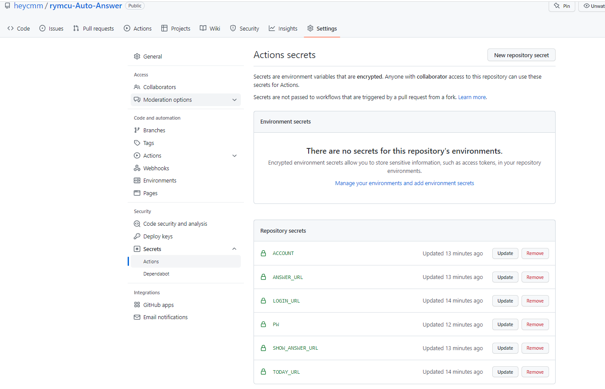

# rymcu-Auto-Answer
r社每日自动答题
# 食用方法 fork此项目，并新增以下变量

# 登录 post
login_url = 'https://rymcu.com/api/console/login'
# 每日一题 get
today_url = 'https://rymcu.com/api/answer/today'
# 查询答案 get
show_answer_url = 'http://1.116.175.112:8089/question/show-answer/%s'
# 答题 post
answer_url = 'https://rymcu.com/api/answer/answer'
# 你的账号
account = ''
# 你的密码
pw = ''